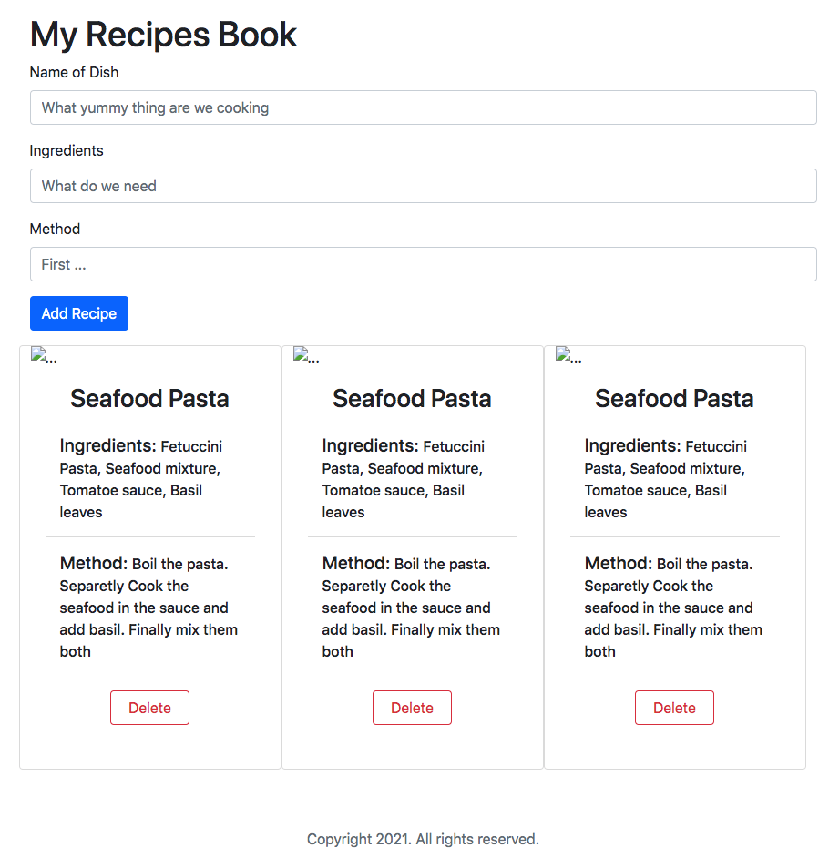

# Task Instructions : 
Create a simple recipe app that should:
* Add recipes that have names and ingredients. 
* Show a list of all recipes 
* Delete recipes 
* Recipes are saved in the browser's local storage.

# Requirements:
* 1. The code should be readable, reusable, and easy to modify. We're looking for production-quality code.
* 2. A detailed Readme file which includes the following:
    * Installation instructionsa.Write out all of the steps to run your app locally
    * Discussion of technologies useda.make a list of the technologies you used including frameworks and libraries.
    * A section describing the requirements and how you met them.

# Technologies Used :
* HTML Language
* BootStrap frameworks

### Example

[Check out a live example](https://ysabelb.github.io/my-recipes-book/)

